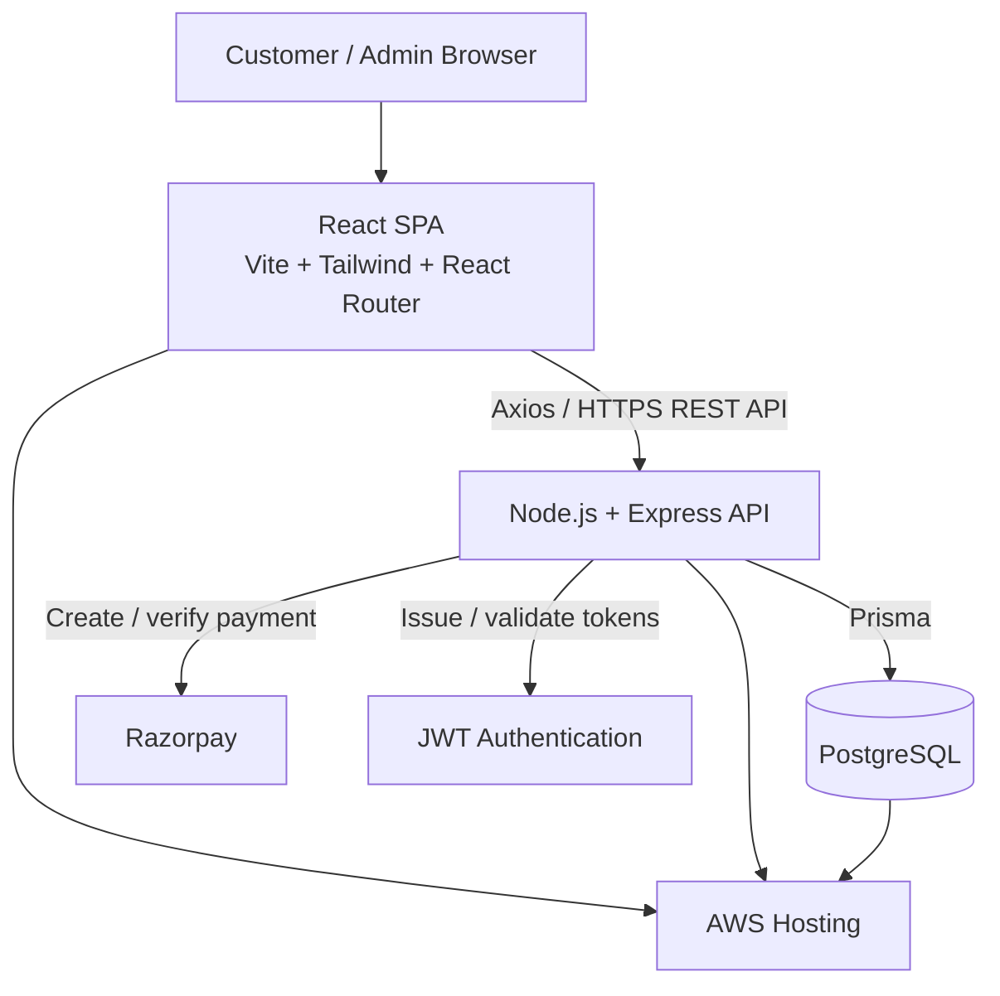

# Pizza Delivery Application Architecture

## Purpose

This document describes the target architecture for a five-phase pizza delivery application. The system is a single-page React client backed by a Node.js REST API, with PostgreSQL as the system of record.

> **Note:** the current frontend starter is TypeScript-based. The planned stack below uses JavaScript as requested; TypeScript can be retained later if the team chooses type safety across the project.

## Technology Stack

| Layer | Technology | Responsibility |
| --- | --- | --- |
| Frontend | React, JavaScript, Vite | Fast single-page customer and admin experience |
| Styling | Tailwind CSS | Responsive UI and design tokens |
| Navigation | React Router | Client-side routes and protected pages |
| HTTP client | Axios | Calls to the backend REST API |
| Backend | Node.js, Express, JavaScript | REST endpoints, business logic, and integrations |
| Database | PostgreSQL | Persistent users, menu, carts, orders, and payments |
| ORM | Prisma | Schema, migrations, and database access |
| Payments | Razorpay | Secure payment-order creation and payment verification |
| Authentication | JWT | Signed access tokens and role-based authorization |
| Hosting | AWS | Deployment, managed database, storage, and observability |

## High-Level Design



## Application Components

### Frontend

- Public pages: home, menu, pizza details, cart, checkout, order confirmation.
- Customer account pages: customer sign up/sign in, profile, address book, and order history.
- Admin account pages: a separate admin sign-in screen and protected administration workspace.
- Admin pages: menu management, order management, and order-status updates.
- Route guards use the JWT and user role (`CUSTOMER` or `ADMIN`) to protect account and admin routes.
- Axios uses one configured API client that adds the access token to authenticated requests and handles expired/invalid sessions.

### Backend API

- Express routers group endpoints by domain: `auth`, `users`, `menu`, `cart`, `orders`, `payments`, and `admin`.
- Controllers validate requests and delegate work to services.
- Services own pricing, availability, order state transitions, Razorpay calls, and Prisma database operations.
- Middleware handles authentication, authorization, validation, errors, request logging, CORS, and rate limiting.
- Payment verification is server-side only. Razorpay secrets must never reach the frontend.

### Role-Based Access Control (RBAC)

The application has **two login experiences**, but should use one shared authentication foundation:

| User type | Login route | Allowed capabilities |
| --- | --- | --- |
| Customer | `/login` | Browse the menu, manage a cart, choose delivery addresses, pay, and view personal orders |
| Admin | `/admin/login` | Manage pizza inventory/menu availability, view and update all orders, and access operational dashboards |

After successful sign-in, the API issues a JWT containing the user's ID and role. The frontend redirects customers to the storefront and admins to `/admin`. The backend independently verifies the token and role on every protected request; hiding an admin menu item in the UI is not a security control.

Recommended middleware chain:

```text
Request → authenticate JWT → requireRole('ADMIN') → admin controller
Request → authenticate JWT → customer/admin controller with ownership checks
```

Admin accounts should be created by an existing administrator or a secure setup process, not through the public customer registration endpoint.

### Data Model

Core entities and their relationships:

```text
User 1 ── * Address
User 1 ── 1 Cart 1 ── * CartItem * ── 1 Pizza
User 1 ── * Order 1 ── * OrderItem
Order 1 ── 1 Payment
Pizza * ── 1 Category
```

Suggested tables: `users`, `addresses`, `categories`, `pizzas`, `pizza_sizes`, `toppings`, `carts`, `cart_items`, `orders`, `order_items`, `payments`, and `order_status_history`.

Order records store a price snapshot (pizza name, selected size, unit price, quantity) so later menu edits never change historical receipts.

## REST API Surface

| Area | Example endpoints |
| --- | --- |
| Authentication | `POST /api/auth/register`, `POST /api/auth/login`, `POST /api/admin/auth/login`, `GET /api/auth/me` |
| Menu | `GET /api/pizzas`, `GET /api/pizzas/:id`, `GET /api/categories` |
| Cart | `GET /api/cart`, `POST /api/cart/items`, `PATCH /api/cart/items/:id`, `DELETE /api/cart/items/:id` |
| Orders | `POST /api/orders`, `GET /api/orders`, `GET /api/orders/:id` |
| Payments | `POST /api/payments/create-order`, `POST /api/payments/verify`, `POST /api/payments/webhook` |
| Admin | `GET /api/admin/inventory`, `POST /api/admin/pizzas`, `PATCH /api/admin/pizzas/:id`, `PATCH /api/admin/orders/:id/status` |

Use `/api/v1` as a version prefix when the first public API contract is stabilized.

## Five Delivery Phases

| Phase | Scope | Key outcome |
| --- | --- | --- |
| 1. Foundation & Menu | Project setup, Tailwind, routing, Prisma/PostgreSQL setup, menu/category read APIs, responsive menu UI | Customers can browse available pizzas |
| 2. Accounts, Cart & RBAC | Customer registration/login, separate admin login, JWT role claims, profile/address support, protected routes, persistent cart, quantity and customization controls | Customers can build a cart; admins have isolated operational access |
| 3. Checkout & Payments | Address selection, price calculation, order creation, Razorpay order flow and signature verification | Customers can place and pay for orders securely |
| 4. Operations | Admin authorization, menu CRUD, order queue, status history, customer order history and status display | Staff can operate the store from the app |
| 5. Production | Tests, validation/security hardening, AWS deployment, secrets/configuration, monitoring, backups, CI/CD | Reliable production-ready release |

## Order Lifecycle

```text
DRAFT_CART → PENDING_PAYMENT → PAID → CONFIRMED → PREPARING
→ OUT_FOR_DELIVERY → DELIVERED

PENDING_PAYMENT → PAYMENT_FAILED
PENDING_PAYMENT / PAID / CONFIRMED → CANCELLED
```

Only authorized staff may transition operational states. Payment status comes from verified Razorpay responses and webhooks, not from the client alone.

## AWS Deployment Target

- **Frontend:** S3 + CloudFront (or AWS Amplify) for the Vite build.
- **API:** ECS Fargate or Elastic Beanstalk behind an Application Load Balancer.
- **Database:** Amazon RDS for PostgreSQL with automated backups.
- **Secrets:** AWS Secrets Manager or Parameter Store for JWT and Razorpay credentials.
- **Files (if needed):** S3 for pizza images.
- **Observability:** CloudWatch logs, alarms, and health checks.

## Security Baseline

- Hash passwords with bcrypt or Argon2; never store plaintext passwords.
- Use short-lived JWT access tokens, secure storage practices, and role checks on every protected API.
- Keep customer registration public, but restrict admin-account creation and require `ADMIN` authorization for inventory and order-management endpoints.
- Validate and sanitize all input at the API boundary.
- Calculate totals on the server from current trusted pricing; never accept the client total as authoritative.
- Verify Razorpay signatures and validate webhook authenticity before marking an order as paid.
- Use HTTPS, restricted CORS origins, rate limiting for authentication endpoints, and environment variables for all secrets.

## Recommended Repository Layout

```text
Pizza_Delivery_Fullstack/
├── client/                  # React + Vite application
│   └── src/{components,pages,routes,services,context}/
├── server/                  # Express application
│   └── src/{routes,controllers,services,middleware,lib}/
├── prisma/
│   ├── schema.prisma
│   └── migrations/
├── docs/
│   └── ARCHITECTURE.md
└── docker-compose.yml        # Local PostgreSQL and app services (optional)
```

The existing frontend can remain at the repository root during phase 1, then be moved into `client/` when the Express API is introduced.
